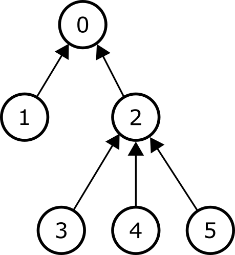

# Pohon

Perhatikan sebuah **pohon** dengan $N$ **verteks**
 yang dinomori dari $0$ hingga $N-1$.
Verteks $0$ disebut sebagai **akar**.
Setiap verteks, kecuali **akar**, mempunyai satu ***parent***.
Untuk setiap $i$, sehingga $1 \leq i < N$,
 *parent* dari verteks $i$ adalah verteks $P[i]$, dengan $P[i] < i$.
Asumsikan juga $P[0] = -1$.

Untuk setiap verteks $i$ ($0 \leq i < N$),
 **subpohon** dari $i$ adalah sebuah kumpulan dari verteks-verteks berikut:
 * $i$,
 * verteks yang memiliki $i$ sebagai *parent*-nya,
 * verteks yang memiliki $i$ sebagai *parent* dari *parent*-nya,
 * verteks yang memiliki $i$ sebagai *parent* dari *parent* dari *parent*-nya,
 * dan seterusnya.

Gambar berikut menunjukan sebuah contoh pohon dengan $N = 6$ verteks.
Setiap panah menghubungkan sebuah verteks dengan *parent*-nya,
 kecuali untuk akar yang tidak mempunyai *parent*.
Subpohon dari verteks $2$ terdiri dari verteks $2, 3, 4$ dan $5$.
Subpohon dari verteks $0$ terdiri dari semua $6$ verteks dari pohon
 dan subpohon dari verteks $4$ terdiri dari hanya verteks $4$.



Setiap verteks diberikan sebuah **bobot** bilangan bulat non-negatif.
Notasikan bobot dari verteks $i$ ($0 \leq i < N$) sebagai $W[i]$.

Tugas Anda adalah menuliskan sebuah program yang akan menjawab $Q$ buah pertanyaan
 yang dideskripsikan dengan sepasang bilangan bulat positif $(L, R)$.
Jawaban dari pertanyaan tersebut dihitung sebagai berikut.

Berikan sebuah bilangan bulat
 yang disebut **koefisien** untuk setiap verteks dari pohon tersebut.
Penempatan ini dideskripsikan dengan sebuah barisan $C[0], \ldots, C[N-1]$,
 dengan $C[i]$ ($0 \leq i < N$) sebagai koefisien yang diberikan untuk verteks $i$.
Sebut barisan ini sebagai **barisan koefisien**.
Perhatikan bahwa elemen dari barisan koefisien bisa saja negatif, nol, ataupun positif.

Untuk sebuah pertanyaan $(L, R)$,
 sebuah barisan koefisien dikatakan **valid**
 apabila untuk setiap verteks $i$ ($0 \leq i < N$),
 kondisi berikut terpenuhi:
 jumlah dari koefisien setiap verteks pada subpohon dari verteks $i$
 tidak kurang dari $L$ dan tidak lebih dari $R$.

Untuk sebuah barisan koefisien $C[0], \ldots, C[N-1]$ yang diberikan,
 **biaya** dari sebuah verteks $i$ adalah $|C[i]| \cdot W[i]$,
 dengan $|C[i]|$ adalah nilai mutlak dari $C[i]$.
Terakhir, **biaya total** adalah jumlah biaya dari semua verteks.
Tugas Anda adalah menghitung untuk setiap pertanyaan,
 **biaya total minimum** yang bisa didapatkan dari suatu barisan koefisien yang valid.

Dapat dibuktikan bahwa untuk setiap pertanyaan, terdapat setidaknya satu barisan koefisien yang valid.

## Detail Implementasi

Anda harus mengimplementasikan dua prosedur berikut:

```
void init(std::vector&lt;int&gt; P, std::vector&lt;int&gt; W)
```

* $P$, $W$: *array* bilangan bulat sepanjang $N$
   yang mendeskripsikan *parent* dan bobot dari setiap verteks.
* Prosedur ini dipanggil tepat sekali
   di awal interaksi antara *grader* dan program Anda untuk setiap kasus uji.

```
long long query(int L, int R)
```
* $L$, $R$: bilangan bulat yang mendeskripsikan sebuah pertanyaan.
* Prosedur ini dipanggil $Q$ kali setelah pemanggilan `init` untuk setiap kasus uji.
* Prosedur ini harus mengembalikan jawaban dari pertanyaan yang diberikan.


## Batasan

* $1 \leq N \leq 200\,000$
* $1 \leq Q \leq 100\,000$
* $P[0] = -1$
* $0 \leq P[i] < i$ untuk setiap $i$ sehingga $1 \leq i < N$
* $0 \leq W[i] \leq 1\,000\,000$ untuk setiap $i$ sehingga $0 \leq i < N$
* $1 \leq L \leq R \leq 1\,000\,000$ pada setiap pertanyaan

## Subsoal

| Subsoal | Skor  | Batasan Tambahan |
| :-----: | :----: | ---------------------- |
|   1     |  $10$  | $Q \leq 10$; $W[P[i]] \leq W[i]$ untuk setiap $i$ sehingga $1 \leq i < N$
|   2     |  $13$  | $Q \leq 10$; $N \leq 2\,000$
|   3     |  $18$  | $Q \leq 10$; $N \leq 60\,000$
|   4     |  $7$   | $W[i] = 1$ untuk setiap $i$ sehingga $0 \leq i < N$
|   5     |  $11$  | $W[i] \leq 1$ untuk setiap $i$ sehingga $0 \leq i < N$
|   6     |  $22$  | $L = 1$
|   7     |  $19$  | Tidak ada batasan tambahan.


## Contoh

Perhatikan pemanggilan berikut:

```
init([-1, 0, 0], [1, 1, 1])
```
Pohon tersebut terdiri dari $3$ verteks, yaitu akar dan $2$ anaknya.
Semua verteks memiliki bobot $1$.

```
query(1, 1)
```

Pada pertanyaan ini $L = R = 1$,
 yang artinya jumlah koefisien dari setiap subpohon harus sama dengan $1$.
Perhatikan barisan koefisien $[-1, 1, 1]$.
Pohon dan barisan koefisien tersebut (dalam kotak yang diarsir) diilustrasikan sebagai berikut.


Untuk setiap verteks $i$ ($0 \leq i < 3$), jumlah koefisien semua verteks
 pada subpohon dari $i$ sama dengan $1$.
Oleh sebab itu, barisan koefisien ini valid.
Biaya total dihitung sebagai berikut:


| Verteks | Bobot | Koefisien | Biaya                      |
| :----: | :----: | :---------: | :-----------------------: |
|   0    |   1    |     -1      | $\mid -1 \mid \cdot 1 = 1$
|   1    |   1    |      1      | $\mid 1 \mid \cdot 1 = 1$
|   2    |   1    |      1      | $\mid 1 \mid \cdot 1 = 1$

Oleh karena itu, biaya total adalah $3$.
Ini adalah satu-satunya barisan koefisien yang valid,
 sehingga pemanggilan ini harus mengembalikan $3$.

```
query(1, 2)
```
Biaya total minimum untuk pertanyaan ini adalah $2$,
 dan didapatkan ketika barisan koefisien adalah $[0, 1, 1]$.

## Contoh *Grader*

Format masukan:

```
N
P[1]  P[2] ...  P[N-1]
W[0]  W[1] ...  W[N-2] W[N-1]
Q
L[0]  R[0]
L[1]  R[1]
...
L[Q-1]  R[Q-1]
```

dengan $L[j]$ dan $R[j]$
 (untuk $0 \leq j < Q$)
 adalah parameter dari pemanggilan `query` ke-$j$.
Perhatikan bahwa baris kedua dari masukan terdiri dari **hanya $N-1$ bilangan bulat**,
 karena contoh masukan tidak membaca nilai dari $P[0]$.

Format keluaran:
```
A[0]
A[1]
...
A[Q-1]
```

dengan $A[j]$
 (untuk $0 \leq j < Q$)
 adalah nilai yang dikembalikan oleh pemanggilan `query` ke-$j$.

