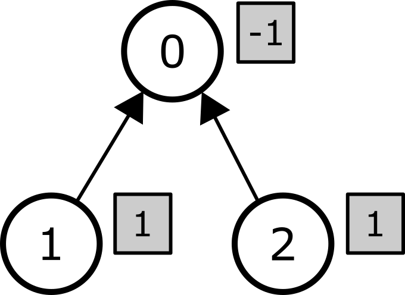

# 木 (Tree)

$0$ から $N-1$ までの番号が付けられた $N$ 個の **頂点** からなる **木** を考える．
頂点 $0$ は **根** と呼ばれる．根を除くすべての頂点は，$1$ つの **親** を持つ．
$1 \leq i < N$ を満たす各 $i$ に対し，頂点 $i$ の親は頂点 $P[i]$ である．ここで，$P[i] < i$ が成り立つ．
さらに，$P[0] = -1$ とする．

任意の頂点 $i$ ($0 \leq i < N$) について，頂点 $i$ の **部分木** とは，以下の頂点の集合である：
 * 頂点 $i$，および
 * 親が $i$ である頂点，および
 * 親の親が $i$ である頂点，および
 * 親の親の親が $i$ である頂点，および
 * $\vdots$

下図は $N = 6$ 個の頂点からなる木の例を示している．
それぞれの矢印は，根を除く各頂点をその親へと結んでいる．
頂点 $2$ の部分木は頂点 $2, 3, 4, 5$ からなる．
頂点 $0$ の部分木は $6$ 個すべての頂点からなり，頂点 $4$ の部分木は頂点 $4$ のみからなる．


各頂点には非負整数の **重み** が割り当てられている．
頂点 $i$ ($0 \leq i < N$) の重みを $W[i]$ で表す．

あなたの課題は，$Q$ 個のクエリに答えるプログラムを書くことである．各クエリは，正整数の組 $(L, R)$ によって表される．
各クエリに対する答えは次のように計算される．

各頂点に対し **係数** と呼ばれる整数を割り当てることを考える．
そのような割り当ては数列 $C[0], \ldots, C[N-1]$ で表される．$C[i]$ ($0 \leq i < N$) は頂点 $i$ に割り当てられる係数である．
この数列を **係数列** と呼ぶことにする．
係数列の各要素は負，$0$，正のいずれにもなり得ることに注意せよ．

クエリ $(L, R)$ において，
すべての頂点 $i$ ($0 \leq i < N$) に対して次の条件が成り立つとき，係数列は **正当** であるという：
頂点 $i$ の部分木に含まれる頂点の係数の総和は $L$ 以上 $R$ 以下である．

係数列 $C[0], \ldots, C[N-1]$ に対して，頂点 $i$ の **コスト** を $|C[i]| \times W[i]$ と定義する．ただし，$|C[i]|$ は $C[i]$ の絶対値を表す．
**総コスト** をすべての頂点のコストの総和と定義する．
あなたの課題は，各クエリに対して，正当な係数列を割り当てたときにあり得る **最小の総コスト** を求めることである．

どのようなクエリに対しても，少なくとも $1$ つの正当な係数列が存在することが証明できる．

## 実装の詳細

あなたは以下の $2$ つの関数を実装する必要がある．

```
void init(std::vector&lt;int&gt; P, std::vector&lt;int&gt; W)
```

* $P$, $W$：各頂点の親と重みを表す長さ $N$ の整数列．
* この関数は，各テストケースについて，採点プログラムとあなたのプログラムとのやりとりの最初に，ちょうど $1$ 回だけ呼び出される．

```
long long query(int L, int R)
```

* $L$, $R$：クエリを表す $2$ つの整数．
* この関数は，各テストケースについて，`init` が呼び出された後に $Q$ 回呼び出される．
* この関数は与えられたクエリに対する答えを返す必要がある．

## 制約

* $1 \leq N \leq 200\,000$
* $1 \leq Q \leq 100\,000$
* $P[0] = -1$
* $0 \leq P[i] < i$ ($1 \leq i < N$)
* $0 \leq W[i] \leq 1\,000\,000$ ($0 \leq i < N$)
* 各クエリについて，$1 \leq L \leq R \leq 1\,000\,000$

## 小課題

| 小課題   | 得点    | 追加の制約 |
| :-----: | :----: | ---------------------- |
|   1     |  $10$  | $Q \leq 10$; $W[P[i]] \leq W[i]$ ($1 \leq i < N$) |
|   2     |  $13$  | $Q \leq 10$; $N \leq 2\,000$
|   3     |  $18$  | $Q \leq 10$; $N \leq 60\,000$
|   4     |  $7$   | $W[i] = 1$ ($0 \leq i < N$) | 
|   5     |  $11$  | $W[i] \leq 1$ ($0 \leq i < N$) |
|   6     |  $22$  | $L = 1$
|   7     |  $19$  | 追加の制約はない．

## 例

以下の呼び出しを考える：

```
init([-1, 0, 0], [1, 1, 1])
```
木は根およびその $2$ 個の子からなる $3$ 個の頂点で構成される．
すべての頂点の重みは $1$ である．

```
query(1, 1)
```

このクエリでは $L = R = 1$ である．
これは，すべての頂点について，その頂点の部分木に含まれる頂点の係数の総和がちょうど $1$ でなければならないことを意味する．
係数列 $[-1, 1, 1]$ を考える．木および各頂点の係数（灰色の長方形の中に書かれている）は下図に示されている．




各頂点 $i$ ($0 \leq i < 3$) について，頂点 $i$ の部分木に含まれる頂点の係数の総和は $1$ である．
よって，この係数列は正当である．
総コストは次のように計算される：

| 頂点 | 重み | 係数 | コスト                      |
| :----: | :----: | :---------: | :-----------------------: |
|   0    |   1    |     -1      | $\lvert -1 \rvert \times 1 = 1$
|   1    |   1    |      1      | $\lvert 1 \rvert \times 1 = 1$
|   2    |   1    |      1      | $\lvert 1 \rvert \times 1 = 1$

したがって総コストは $3$ である．
正当な係数列はこれしか存在しないため，この呼び出しに対しては $3$ を返す必要がある．

```
query(1, 2)
```

このクエリにおける最小の総コストは $2$ であり，
係数列が $[0, 1, 1]$ のときに達成される．

## 採点プログラムのサンプル

入力形式：

```
N
P[1]  P[2] ...  P[N-1]
W[0]  W[1] ...  W[N-2] W[N-1]
Q
L[0]  R[0]
L[1]  R[1]
...
L[Q-1]  R[Q-1]
```

$L[j]$ および $R[j]$ ($0 \leq j < Q$) は `query` の $j$ 番目の呼び出しにおける引数である．
採点プログラムのサンプルは $P[0]$ の値を読み込まないため，入力の $2$ 行目は **$N-1$ 個の整数のみ** を含むことに注意せよ．

出力形式：

```
A[0]
A[1]
...
A[Q-1]
```

$A[j]$ ($0 \leq j < Q$) は `query` の $j$ 番目の呼び出しにおける戻り値である．
