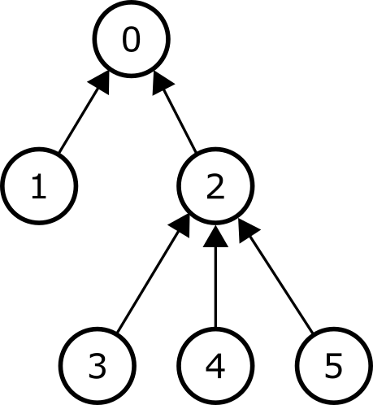
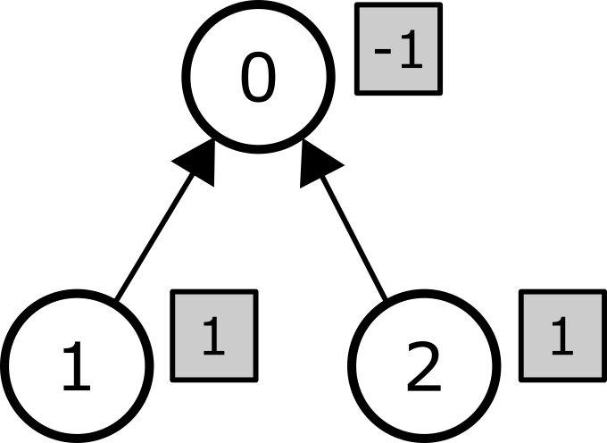

# Мод

$0$-с $N-1$ хүртэл дугаарлагдсан $N$ **орой**-оос бүрдэх **мод**-г авч үзье.
$0$ оройг **үндэс** гэнэ.
Үндэсээс бусад орой бүр нэг **эцэг**-тэй байна.
Every vertex, except for the root, has a single **parent**.
$1 \leq i < N$ байх $i$ бүрийн хувьд $i$ оройн эцэг нь $P[i]$ зангилаа байх ба энд $P[i] < i$ байна. 
Мөн бид $P[0] = -1$ гэж үзнэ.

Дурын $i$ ($0 \leq i < N$) оройн хувьд $i$-ийн **дэд мод** гэж дараах оройн багцыг хэлнэ: 
 * $i$, мөн
 * эцэг нь $i$ байх дурын орой, мөн 
 * эцгийн эцэг нь $i$ байх дурын орой, мөн 
 * эцгийн эцгийн эцэг нь $i$ байх дурын орой, мөн
 * гэх мэт.

Доорх зурагт $N = 6$ оройтой жишээ модыг үзүүлэв.
Сум бүр нь үндэснээс бусад оройг эцэгтэй нь холбож байна.
$2$ оройн дэд мод нь $2, 3, 4$ болон $5$ оройнуудыг агуулна.
$0$ оройн дэд мод нь модны бүх $6$ оройг агуулж байгаа бол харин $4$ оройн дэд мод нь зөвхөн $4$ оройгоос бүрдэж байна.



Орой бүрд сөрөг бус **жин** оноогдсон.
Бид $i$ ($0 \leq i < N$) оройн жинг $W[i]$ гэж тэмдэглэнэ.

Таны даалгавар бол $(L, R)$ эерэг бүхэл хос тоогоор тодорхойлогдсон $Q$ асуулгад хариулах програм бичих явдал юм.
Асуулгын хариултыг дараах байдлаар тооцоолно.
Модны орой бүрд **коэффицент** гэх бүхэл тоо оноох талаар авч үзье.
Энэхүү оноолтыг $C[0], \ldots, C[N-1]$ дарааллаар дүрсэлсэн бөгөөд $C[i]$ ($0 \leq i < N$) нь $i$ оройд оноогдсон коэффициент юм.
Энэ дарааллыг **коэффицентийн дараалал** гэж нэрлэнэ.
Коэффициентийн дарааллын элементүүд нь сөрөг, $0$, эерэг утгатай байж болохыг анхаарна уу.

$(L, R)$ асуулгын хувьд $i$ ($0 \leq i < N$) орой бүрийн хувьд $i$ оройн дэд модны оройнуудын коэффициентийн нийлбэр нь $L$-ээс багагүй, $R$-аас ихгүй байх нөхцөл биелдэг бол коэффициентийн дарааллыг **хүчинтэй** гэнэ.

$C[0], \ldots, C[N-1]$ өгөгдсөн коэффициент дарааллын хувьд $i$ оройн **зардал** нь $|C[i]| \cdot W[i]$ байх ба энд $|C[i]|$ нь $C[i]$-ийн үнэмлэхүй (absolute) утгыг илэрхийлнэ.
Эцэст нь **нийт зардал** нь бүх оройнуудын зардлын нийлбэр юм.
Таны даалгавар бол асуулга бүрийн хувьд хүчинтэй коэффициентийн дарааллаар хүрч болох **хамгийн бага нийт зардал**-ыг тооцоолох явдал юм.

Аливаа асуулгад дор хаяж нэг хүчинтэй коэффициентийн дараалал байх болно.

## Хэрэгжүүлэлтийн мэдээлэл

Та дараах функцийг хэрэгжүүлэх ёстой:

```
void init(std::vector&lt;int&gt; P, std::vector&lt;int&gt; W)
```

* $P$, $W$: эцэг болон жинг тодорхойлох $N$ урттай бүхэл тоон массив
* Энэ функцийг тестийн тохиолдол бүрд грэйдэр болон таны програм хоорондын харилцан үйлчлэлийн эхэнд яг нэг удаа дуудна.

```
long long query(int L, int R)
```
* $L$, $R$: асуулгыг тодорхойлох бүхэл тоо.
* Тестийн тохиолдол бүрд `init` функцийг дуудагдсаны дараа энэ функцийг $Q$ удаа ажиллуулна.
* Энэ функц нь өгсөн асуулгын хариултыг буцаана.


## Хязгаарлалт

* $1 \leq N \leq 200\,000$
* $1 \leq Q \leq 100\,000$
* $P[0] = -1$
* $0 \leq P[i] < i$, $1 \leq i < N$ байх $i$ бүрийн хувьд 
* $0 \leq W[i] \leq 1\,000\,000$, $0 \leq i < N$ байх $i$ бүрийн хувьд
* $1 \leq L \leq R \leq 1\,000\,000$, бүх асуулгад

## Дэд бодлого

| Дэд бодлого | Оноо  | Нэмэлт хязгаарлалт |
| :-----: | :----: | ---------------------- |
|   1     |  $10$  | $Q \leq 10$; $W[P[i]] \leq W[i]$, $1 \leq i < N$ байх $i$ бүрийн хувьд
|   2     |  $13$  | $Q \leq 10$; $N \leq 2\,000$
|   3     |  $18$  | $Q \leq 10$; $N \leq 60\,000$
|   4     |  $7$   | $W[i] = 1$, $0 \leq i < N$ байх $i$ бүрийн хувьд
|   5     |  $11$  | $W[i] \leq 1$, $0 \leq i < N$ байх $i$ бүрийн хувьд
|   6     |  $22$  | $L = 1$
|   7     |  $19$  | Нэмэлт хязгаарлалт байхгүй.


## Жишээ

Дараах дуудалтыг хийсэн гэе:

```
init([-1, 0, 0], [1, 1, 1])
```
Мод нь $3$ оройтой, үндэс болон $2$ хүү.
Бүх оройн жин нь $1$.

```
query(1, 1)
```

Энэ асуулгад $L = R = 1$ ба энэ нь дэд мод бүрийн коэффициентүүдийн нийлбэр $1$-тэй тэнцүү байх ёстой гэсэн үг юм. $[-1, 1, 1]$ коэффициентийн дарааллыг авч үзье.
Уг мод ба оройн коэффициентүүдийг (сүүдэрлэсэн тэгш өнцөгтөөр тэмдэглэсэн) зурагт харуулав.



$i$ ($0 \leq i < 3$) орой бүрийн хувьд $i$ дэд модны бүх оройнуудын коэффициентүүдийн нийлбэр $1$-тэй тэнцүү байна. 
Тиймээс энэ коэффициентийн дараалал хүчинтэй тул нийт зардлыг дараах байдлаар тооцно:


| Орой | Жин | Коэффициент | Зардал                      |
| :----: | :----: | :---------: | :-----------------------: |
|   0    |   1    |     -1      | $\mid -1 \mid \cdot 1 = 1$
|   1    |   1    |      1      | $\mid 1 \mid \cdot 1 = 1$
|   2    |   1    |      1      | $\mid 1 \mid \cdot 1 = 1$

Тиймээс нийт зардал $3$. Энэ бол цорын ганц хүчинтэй коэффициентийн дараалал тул энэ дуудалт нь $3$-ыг буцаана.

```
query(1, 2)
```
Энэ асуулгын хамгийн бага нийт зардал нь $2$ байх ба коэффициентүүдийн дараалал $[0, 1, 1]$ үед гарна.

## Жишээ грэйдэр

Оролтын формат:

```
N
P[1]  P[2] ...  P[N-1]
W[0]  W[1] ...  W[N-2] W[N-1]
Q
L[0]  R[0]
L[1]  R[1]
...
L[Q-1]  R[Q-1]
```

Энд $L[j]$ болон $R[j]$ ($0 \leq j < Q$) нь $j$ дүгээр `query` дуудалтын оролтын аргументууд юм.
Оролтын хоёр дахь мөрөнд **зөвхөн $N-1$ бүхэл тоо** агуулагдаж байгааг анхаарна уу, учир нь грэйдэр нь $P[0]$-ын утгыг уншихгүй.

Гаралтын формат:
```
A[0]
A[1]
...
A[Q-1]
```
Энд $A[j]$ ($0 \leq j < Q$) нь $j$ дүгээр дуудалтаар `query` руу буцаасан утга юм.

