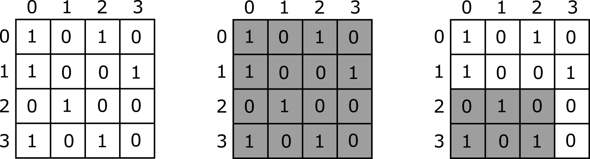

# Mozaik

Salma namerava pobarvati glineni mozaik na steni.
Mozaik je mreža velikosti $N \times N$,
 sestavljena iz $N^2$ prvotno nepobarvanih ploščic velikosti $1 \times 1$.
Vrstice mozaika so oštevilčene od $0$ do $N-1$ od zgoraj navzdol,
 stolpci pa so oštevilčeni od $0$ do $N-1$ od leve proti desni.
Ploščica v vrstici $i$ in stolpcu $j$ ($0 \leq i < N$, $0 \leq j < N$) je označena z $(i,j)$.
Vsako ploščico mora pobarvati bodisi
 belo (označeno z $0$) bodisi črno (označeno z $1$).

Da bi pobarvala mozaik, Salma najprej izbere polji $X$ in $Y$ dolžine $N$,
 katerih vrednosti so $0$ in $1$ in velja $X[0] = Y[0]$.
Ploščice v zgornji vrstici (vrstica $0$) pobarva skladno s poljem $X$,
 tako da je barva ploščice $(0,j)$ $X[j]$ ($0 \leq j < N$).
Prav tako pobarva ploščice v skrajno levem stolpcu (stolpec $0$) skladno s poljem $Y$,
 tako da je barva ploščice $(i,0)$ $Y[i]$ ($0 \leq i < N$).

Nato ponavlja naslednje korake, dokler niso vse ploščice pobarvane:
* Poišče *nepobarvano* ploščico $(i,j)$, kjer sta
 njen zgornji sosed (ploščica $(i-1, j)$) in levi sosed (ploščica $(i, j-1)$)
 *že pobarvana*.
*  če sta oba soseda bela, pobarva ploščico $(i,j)$ na črno;
 sicer pobarva ploščico $(i, j)$ na belo.

Pokažemo lahko, da končne barve ploščic niso odvisne
od vrstnega reda barvanja.

Yasmin je zelo radovedna glede barv ploščic v mozaiku.
Salmi postavi $Q$ vprašanj, oštevilčenih od $0$ do $Q-1$.
Z vprašanjem $k$ ($0 \leq k < Q$)
 Yasmin določi podpravokotnik mozaika z:
* zgornjo vrstico $T[k]$ in spodnjo vrstico $B[k]$ ($0 \leq T[k] \leq B[k] < N$),
* najbolj levim stolpcem $L[k]$ in najbolj desnim stolpcem $R[k]$ ($0 \leq L[k] \leq R[k] < N$).

Odgovor na to vprašanje je število črnih ploščic tega podpravokotnika.
Natančneje, Salma mora izračunati, koliko ploščic $(i, j)$ obstaja,
 kjer $T[k] \leq i \leq B[k]$, $L[k] \leq j \leq R[k]$
 in je barva ploščice $(i,j)$ črna.

Napišite program, ki odgovarja na Yasminina vprašanja.


<div style="page-break-after: always;"></div>
## Podrobnosti implementacije

Implementirajte naslednjo funkcijo.

```
std::vector&lt;long long&gt; mosaic(
	std::vector&lt;int&gt; X, std::vector&lt;int&gt; Y,
    std::vector&lt;int&gt; T, std::vector&lt;int&gt; B,
    std::vector&lt;int&gt; L, std::vector&lt;int&gt; R)
```

* $X$, $Y$: polji dolžine $N$, ki opisujeta barve ploščic
 v zgornji vrstici in v levem stolpcu.
* $T$, $B$, $L$, $R$: polja dolžine $Q$, ki opisujejo vprašanja, ki jih zastavlja Yasmin.
* Funkcija naj vrne polje $C$ dolžine $Q$, kjer $C[k]$ podaja odgovor na vprašanje $k$ ($0 \leq k < Q$).
* Funkcijo se kliče natanko enkrat za vsak testni primer.

## Omejitve

* $1 \leq N \leq 200\,000$
* $1 \leq Q \leq 200\,000$
* $X[i] \in \{0, 1\}$ in $Y[i] \in \{0, 1\}$
 za vsak $i$ velja $0 \leq i < N$
* $X[0] = Y[0]$
* $0 \leq T[k] \leq B[k] < N$, $0 \leq L[k] \leq R[k] < N$ in
 za vsak $k$ velja $0 \leq k < Q$

## Podnaloge

| Podnaloga | Točke  | Dodatne omejitve |
| :-----: | :----: | ---------------------- |
| 1       | $5$    | $N \leq 2; Q \leq 10$
| 2       | $7$    | $N \leq 200; Q \leq 200$
| 3       | $7$    | $T[k] = B[k] = 0$ (za vsak $k$ velja $0 \leq k < Q$)
| 4       | $10$   | $N \leq 5000$
| 5       | $8$    | $X[i] = Y[i] = 0$ (za vsak $i$ velja $0 \leq i < N$)
| 6       | $22$   | $T[k] = B[k]$ in $L[k] = R[k]$ (za vsak $k$ velja $0 \leq k < Q$)
| 7       | $19$   | $T[k] = B[k]$ (za vsak $k$ velja $0 \leq k < Q$)
| 8       | $22$   | Ni dodatnih omejitev.


<div style="page-break-after: always;"></div>
## Primer

Razmislite o naslednjem klicu.

```
mosaic([1, 0, 1, 0], [1, 1, 0, 1], [0, 2], [3, 3], [0, 0], [3, 2])
```

Ta primer je prikazan na spodnjih slikah.
Leva slika prikazuje barve ploščic mozaika.
Srednja in desna slika prikazujeta podpravokotnike,
 za katere Yasmin sprašuje v prvem in drugem vprašanju.



Odgovora na vprašanji
 (število enic v osenčenih podpravokotnikih)
 sta 7 in 3.
Zatorej funkcija vrne $[7, 3]$.

## Vzorčni ocenjevalnik

Oblika vhoda:

```
N
X[0]  X[1]  ...  X[N-1]
Y[0]  Y[1]  ...  Y[N-1]
Q
T[0]  B[0]  L[0]  R[0]
T[1]  B[1]  L[1]  R[1]
...
T[Q-1]  B[Q-1]  L[Q-1]  R[Q-1]
```

Oblika izhoda:

```
C[0]
C[1]
...
C[S-1]
```

Tu je $S$ dolžina polja $C$, ki ga vrne `mosaic`.