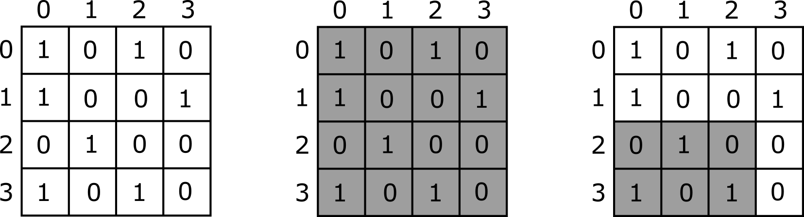

# Mozaik

Salma, bir duvardaki kil mozaiğini renklendirmeyi planlar.
Mozaik $N \times N$ ızgarasıdır ve bu ızgara
başlangıçta renklendirilmemiş $N^2$ adet $1 \times 1$ kare fayanslardan oluşur.
Mozaiğin satırları yukarıdan aşağıya $0$ dan $N-1$ 'e kadar numaralandırılmıştır,
 ve sütunlar soldan sağa $0$ dan $N-1$ 'e kadar numaralandırılmıştır.
$i$ satırı ve $j$ sütunundaki ( $0 \leq i < N$ , $0 \leq j < N$ ) fayans $(i,j)$ ile gösterilir.
Her bir fayansın rengi şunlardan biri olmalıdır:
 beyaz ( $0$ ile gösterilir) veya siyah ( $1$ ile gösterilir).

Mozaiği renklendirmek için Salma önce $N$ uzunluğunda iki $X$ ve $Y$ dizisi seçer.
Bu dizilerin her biri $0$ ve $1$ değerlerinden oluşur, öyle ki $X[0] = Y[0]$ .
Salma, en üst sıradaki (sıra $0$) fayansları $X$ dizisine göre boyar,
 öyle ki $(0,j)$ fayansının rengi $X[j]$ ($0 \leq j < N$) dir.
Ayrıca en soldaki sütunun (sütun $0$) fayanslarını $Y$ dizisine göre renklendirir,
 öyle ki $(i,0)$ fayansının rengi $Y[i]$ ($0 \leq i < N$) dir.

Daha sonra tüm fayanslar renklenene kadar şu adımları tekrarlar:
* Herhangi bir *renklendirilmemiş* $(i,j)$ fayansını bulur öyle ki
 yukarı komşusunun (fayans $(i-1, j)$ ) ve sol komşusunun (fayans $(i, j-1)$ )
 ikisi de *zaten renklendirilmiştir*.
* Daha sonra, eğer bu iki komşusu da beyazsa, $(i,j)$ fayansını siyaha boyar;
 Aksi takdirde $(i, j)$ fayansını beyaza boyar.

Fayansların son renklerinin, Salma'nın onları renklendirme sırasına bağlı olmadığı gösterilebilir.

Yasmin, mozaikteki fayansların renklerini çok merak ediyor ve Salma'ya $0$ dan $Q-1$ e kadar numaralandırılmış $Q$ tane soru soruyor.
Soru $k$ ( $0 \leq k < Q$ ) için,
 Yasmin, mozaiğin alt dikdörtgenini şu şekilde belirtir:
* En üst satır $T[k]$ ve en alt satır $B[k]$ ( $0 \leq T[k] \leq B[k] < N$ ),
* En soldaki sütun $L[k]$ ve en sağdaki sütun $R[k]$ ( $0 \leq L[k] \leq R[k] < N$ ).

The answer to the question is the number of black tiles in this subrectangle.
Specifically, Salma should find how many tiles $(i, j)$ exist,
 such that $T[k] \leq i \leq B[k]$, $L[k] \leq j \leq R[k]$,
 and the colour of tile $(i,j)$ is black.
 
 Sorunun cevabı bu alt dikdörtgendeki siyah taşların sayısıdır.
Daha açık bir ifadeyle, Salma $T[k] \leq i \leq B[k]$ , $L[k] \leq j \leq R[k]$ olmak üzere kaç tane $(i, j)$ fayansının renginin siyah olduğunu bulmalıdır.

Yasmin'in sorularını cevaplayan bir program yazın.

## Kodlama Detayları

Aşağıdaki prosedürü kodlamalısınız. 

```
std::vector&lt;long long&gt; mosaic(
	std::vector&lt;int&gt; X, std::vector&lt;int&gt; Y,
    std::vector&lt;int&gt; T, std::vector&lt;int&gt; B,
    std::vector&lt;int&gt; L, std::vector&lt;int&gt; R)
```

* $X$ , $Y$ : sırasıyla en üst satırdaki ve en sol sütundaki fayansların renklerini tanımlayan $N$ uzunluklu diziler.
* $T$ , $B$ , $L$ , $R$ : Yasmin'in sorduğu soruları tanımlayan $Q$ uzunluğunda diziler.
* Prosedür, $Q$ uzunluğunda bir $C$ dizisi dönmelidir,
 öyle ki $C[k]$, $k$ sorusunun cevabını sağlar ($0 \leq k < Q$).
* Bu prosedür her test durumu için tam olarak bir kez çağrılır.


## Kısıtlar

* $1 \leq N \leq 200\,000$
* $1 \leq Q \leq 200\,000$
* $0 \leq i < N$ şartını sağlayan her $i$ için $X[i] \in \{0, 1\}$ ve $Y[i] \in \{0, 1\}$.
* $X[0] = Y[0]$
* $0 \leq k < Q$ şartını sağlayan her $k$ için $0 \leq T[k] \leq B[k] < N$ ve $0 \leq L[k] \leq R[k] < N$. 

## Altgörevler

| Altgörev | Puan  | Ek Kısıtlar |
| :-----: | :----: | ---------------------- |
| 1       | $5$    | $N \leq 2; Q \leq 10$
| 2       | $7$    | $N \leq 200; Q \leq 200$
| 3       | $7$    | $T[k] = B[k] = 0$ (her bir $k$ için, öyle ki $0 \leq k < Q$)
| 4       | $10$   | $N \leq 5000$
| 5       | $8$    | $X[i] = Y[i] = 0$ (her bir $i$ için, öyle ki $0 \leq i < N$)
| 6       | $22$   | $T[k] = B[k]$ and $L[k] = R[k]$ (her bir $k$ için, öyle ki $0 \leq k < Q$)
| 7       | $19$   | $T[k] = B[k]$ (her bir $k$ için, öyle ki $0 \leq k < Q$)
| 8       | $22$   | Ek kısıt yoktur.

## Örnek

Aşağıdaki çağrıyı göz önüne alın.
```
mosaic([1, 0, 1, 0], [1, 1, 0, 1], [0, 2], [3, 3], [0, 0], [3, 2])
```


Bu örnek aşağıdaki resimlerde açıklanmıştır. Soldaki resimde mozaikteki fayansların renkleri görülmektedir. Ortadaki ve sağdaki resimler Yasmin'in sırasıyla birinci ve ikinci soruda sorduğu alt dikdörtgenleri göstermektedir.



Soruların cevapları
 (yani gölgeli dikdörtgenlerdeki birlerin sayısı)
 sırasıyla 7 ve 3'tür.
Bu nedenle, prosedür $[7, 3]$ dönmelidir.

## Örnek Değerlendirici

Girdi formatı:

```
N
X[0]  X[1]  ...  X[N-1]
Y[0]  Y[1]  ...  Y[N-1]
Q
T[0]  B[0]  L[0]  R[0]
T[1]  B[1]  L[1]  R[1]
...
T[Q-1]  B[Q-1]  L[Q-1]  R[Q-1]
```

Çıktı formatı:

```
C[0]
C[1]
...
C[S-1]
```

Burada $S$ , `mosaic` tarafından dönen $C$ dizisinin uzunluğudur.

