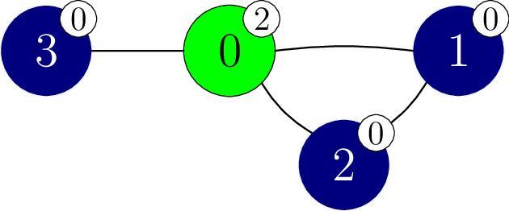
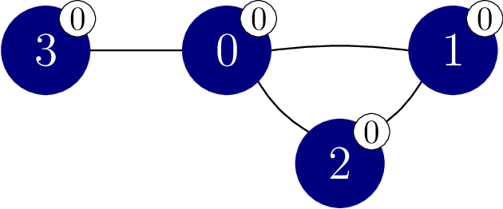
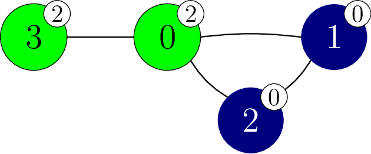

# Το Αίνιγμα της Σφίγγας

Η Μεγάλη Σφίγγα έχει ένα αίνιγμα για σένα. 
Σου δίνεται ένα γράφημα με $N$ κορυφές.
Οι κορυφές είναι αριθμημένες από το $0$ έως το $N - 1$.
Υπάρχουν $M$ ακμές στο γράφημα, αριθμημένες από  $0$ έως $M-1$.
Κάθε ακμή συνδέει ένα ζευγάρι διακριτών κορυφών και είναι αμφίδρομη.
Συγκεκριμένα, για κάθε $j$ από $0$ έως και $M - 1$,
 η ακμή $j$ ενώνει τις κορυφές $X[j]$ και $Y[j]$.
Υπάρχει το πολύ μία ακμή που συνδέει οποιοδήποτε ζευγάρι κορυφών.
Δύο κορυφές ονομάζονται **γειτονικές**
 αν συνδέονται με μία ακμή.

Μια ακολουθία κορυφών $v_0, v_1, \ldots, v_k$ (για $k \ge 0$)
 ονομάζεται **μονοπάτι**
 αν κάθε δύο διαδοχικές κορυφές $v_l$ και $v_{l+1}$
 (για κάθε $l$ τέτοιο ώστε $0 \le l \lt k$)
 είναι γειτονικές.
Λέμε ότι ένα μονοπάτι $v_0, v_1, \ldots, v_k$ **συνδέει** τις κορυφές $v_0$ και $v_k$.
Στο γράφημα που σου δόθηκε, κάθε ζευγάρι κορυφών συνδέεται με κάποιο μονοπάτι.

Υπάρχουν $N + 1$ χρώματα, αριθμημένα από το $0$ έως το $N$.
Το χρώμα $N$ είναι ιδιαίτερο και ονομάζεται **χρώμα της Σφίγγας**.
Κάθε κορυφή έχει ανατεθεί ένα χρώμα.
Συγκεκριμένα, η κορυφή $i$ ($0 \le i \lt N$) έχει το χρώμα $C[i]$.
Πολλαπλές κορυφές μπορεί να έχουν το ίδιο χρώμα,
 και μπορεί να υπάρχουν χρώματα που δεν έχουν ανατεθεί σε καμία κορυφή.
Καμία κορυφή δεν έχει το χρώμα της Σφίγγας,
 δηλαδή, $0 \le C[i] \lt N$ ($0 \le i \lt N$).

Ένα μονοπάτι $v_0, v_1, \ldots, v_k$ (για $k \ge 0$)
 ονομάζεται **μονοχρωματικό**
 αν
 όλες οι κορυφές του έχουν το ίδιο χρώμα,
 δηλαδή, $C[v_l] = C[v_{l+1}]$ (για κάθε $l$ τέτοιο ώστε $0 \le l \lt k$).
Επιπλέον, λέμε ότι οι κορυφές $p$ και $q$ ($0 \le p \lt N$, $0 \le q \lt N$)
 είναι στο ίδιο **μονοχρωματικό στοιχείο**
 αν και μόνο αν συνδέονται με μονοχρωματικό μονοπάτι.

Γνωρίζεις τις κορυφές και τις ακμές,
 αλλά δεν γνωρίζεις ποιο χρώμα έχει κάθε κορυφή.
Θέλεις να μάθεις τα χρώματα των κορυφών,
 πραγματοποιώντας **πειράματα αναχρωματισμού**.

Σε ένα πείραμα αναχρωματισμού,
 μπορείς να αναχρωματίσεις αυθαίρετα πολλές κορυφές.
Συγκεκριμένα, για να εκτελέσεις ένα πείραμα αναχρωματισμού
 πρώτα επιλέγεις έναν πίνακα $E$ με μέγεθος $N$,
 όπου για κάθε $i$ ($0 \le i \lt N$),
 το $E[i]$ είναι μεταξύ $-1$ και $N$ **περιλαμβανομένων**.
Στη συνέχεια, το χρώμα της κάθε κορυφής $i$ γίνεται $S[i]$, όπου η τιμή του $S[i]$ είναι:
* $C[i]$, δηλαδή, το αρχικό χρώμα του $i$, αν $E[i] = -1$, ή
* $E[i]$, διαφορετικά.

Σημειώστε ότι αυτό σημαίνει ότι μπορείτε να χρησιμοποιήσετε το χρώμα της Σφίγγας στον αναχρωματισμό σας.

Τέλος, η Μεγάλη Σφίγγα ανακοινώνει
 τον αριθμό των μονοχρωματικών στοιχείων στο γράφημα,
 αφού οριστεί το χρώμα της κάθε κορυφής $i$ σε $S[i]$ ($0 \le i \lt N$).
Ο νέος χρωματισμός εφαρμόζεται μόνο για αυτό το συγκεκριμένο πείραμα αναχρωματισμού,
 επομένως **τα χρώματα όλων των κορυφών επανέρχονται στα αρχικά μετά τη λήξη του πειράματος**.

Η αποστολή σου είναι να αναγνωρίσεις τα χρώματα των κορυφών στο γράφημα
 πραγματοποιώντας το πολύ $2\,750$ πειράματα αναχρωματισμού.
Μπορείς επίσης να λάβεις μερική βαθμολογία
 αν καθορίσεις σωστά για κάθε ζευγάρι γειτονικών κορυφών
 αν έχουν το ίδιο χρώμα.

## Λεπτομέρειες Υλοποίησης

Πρέπει να υλοποιήσεις την ακόλουθη διαδικασία.

```
std::vector&lt;int&gt; find_colours(int N,
    std::vector&lt;int&gt; X, std::vector&lt;int&gt; Y)
```

* $N$: ο αριθμός των κορυφών στο γράφημα.
* $X$, $Y$: πίνακες μήκους $M$ που περιγράφουν τις ακμές.
* Αυτή η διαδικασία πρέπει να επιστρέψει έναν πίνακα $G$ μήκους $N$,
   που αντιπροσωπεύει τα χρώματα των κορυφών στο γράφημα.
* Αυτή η διαδικασία καλείται ακριβώς μία φορά για κάθε δοκιμή.

Η παραπάνω διαδικασία μπορεί να καλέσει την ακόλουθη διαδικασία
 για να εκτελέσει πειράματα αναχρωματισμού:

```
int perform_experiment(std::vector&lt;int&gt; E)
```

* $E$: ένας πίνακας μήκους $N$ που καθορίζει πώς πρέπει να αναχρωματιστούν οι κορυφές.
* Αυτή η διαδικασία επιστρέφει τον αριθμό των μονοχρωματικών στοιχείων
   μετά τον αναχρωματισμό των κορυφών σύμφωνα με το $E$.
* Αυτή η διαδικασία μπορεί να κληθεί το πολύ $2\,750$ φορές.

Ο αξιολογητής είναι **μη προσαρμοστικός**, δηλαδή,
 τα χρώματα των κορυφών είναι σταθερά πριν πραγματοποιηθεί η κλήση της `find_colours`.

## Περιορισμοί

* $2 \le N \le 250$
* $N - 1 \le M \le \frac{N \cdot (N - 1)}{2}$
* $0 \le X[j] \lt Y[j] \lt N$ για κάθε $j$ τέτοιο ώστε $0 \le j \lt M$.
* $X[j] \neq X[k]$ ή $Y[j] \neq Y[k]$
   για κάθε $j$ και $k$ τέτοιο ώστε $0 \le j \lt k \lt M$.
* Κάθε ζευγάρι κορυφών συνδέεται με κάποιο μονοπάτι.
* $0 \le C[i] \lt N$ για κάθε $i$ τέτοιο ώστε $0 \le i \lt N$.

## Subtasks

| Subtask | Βαθμολογία | Πρόσθετοι Περιορισμοί |
| :-------: | :-------: | -------------------- |
| 1         | $3$       | $N = 2$ |
| 2         | $7$       | $N \le 50$ |
| 3         | $33$      | Το γράφημα είναι μονοπάτι: $M = N - 1$ και οι κορυφές $j$ και $j+1$ είναι γειτονικές ($0 \leq j < M$). |
| 4         | $21$      | Το γράφημα είναι πλήρες: $M = \frac{N \cdot (N - 1)}{2}$ και οποιεσδήποτε δύο κορυφές είναι γειτονικές. |
| 5         | $36$      | Χωρίς πρόσθετους περιορισμούς. |

Σε κάθε υποερώτημα, μπορείς να λάβεις

 μερική βαθμολογία
 αν το πρόγραμμα σου καθορίσει σωστά
 για κάθε ζευγάρι γειτονικών κορυφών
 αν έχουν το ίδιο χρώμα.

Πιο συγκεκριμένα,
 λαμβάνεις ολόκληρη τη βαθμολογία του υποερωτήματος
 αν σε όλες τις δοκιμές του,
 ο πίνακας $G$ που επιστρέφει η `find_colours`
 είναι ακριβώς ο ίδιος με τον πίνακα $C$
 (δηλαδή $G[i] = C[i]$
 για όλα τα $i$ τέτοια ώστε $0 \le i \lt N$).
Διαφορετικά,
 λαμβάνεις το $50\%$ της βαθμολογίας για ένα υποερώτημα
 αν οι ακόλουθες συνθήκες ισχύουν
 σε όλες τις δοκιμές του:
* $0 \le G[i] \lt N$
   για κάθε $i$ τέτοιο ώστε $0 \le i \lt N$;
* Για κάθε $j$ τέτοιο ώστε $0 \le j \lt M$:
  * $G[X[j]] = G[Y[j]]$ αν και μόνο αν $C[X[j]] = C[Y[j]]$.

## Παράδειγμα

Σκέψου την ακόλουθη κλήση.

```
find_colours(4, [0, 1, 0, 0], [1, 2, 2, 3])
```

Για αυτό το παράδειγμα, υποθέτουμε ότι
 τα (κρυφά) χρώματα των κορυφών δίνονται από
 $C = [2, 0, 0, 0]$.
Αυτό το σενάριο εμφανίζεται στην ακόλουθη εικόνα.
Τα χρώματα επιπλέον αναπαρίστανται από αριθμούς σε λευκές ετικέτες που επισυνάπτονται σε κάθε κορυφή.



Η διαδικασία μπορεί να καλέσει `perform_experiment` ως εξής.

```
perform_experiment([-1, -1, -1, -1])
```

Σε αυτήν την κλήση, καμία κορυφή δεν αναχρωματίζεται, καθώς όλες οι κορυφές διατηρούν τα αρχικά τους χρώματα.

Σκέψου την κορυφή $1$ και την κορυφή $2$.
Και οι δύο έχουν χρώμα $0$ και το μονοπάτι $1, 2$ είναι ένα μονοχρωματικό μονοπάτι.
Ως αποτέλεσμα, οι κορυφές $1$ και $2$ είναι στο ίδιο μονοχρωματικό στοιχείο.

Σκέψου την κορυφή $1$ και την κορυφή $3$.
Αν και οι δύο έχουν χρώμα $0$,
 βρίσκονται σε διαφορετικά μονοχρωματικά στοιχεία
 καθώς δεν υπάρχει μονοχρωματικό μονοπάτι που τις συνδέει.

Συνολικά, υπάρχουν $3$ μονοχρωματικά στοιχεία,
 με κορυφές $\{0\}$, $\{1, 2\}$ και $\{3\}$.
Έτσι, αυτή η κλήση επιστρέφει $3$.

Η διαδικασία μπορεί τώρα να καλέσει `perform_experiment` ως εξής.

```
perform_experiment([0, -1, -1, -1])
```

Σε αυτήν την κλήση, μόνο η κορυφή $0$ αναχρωματίζεται στο χρώμα $0$,
 που έχει ως αποτέλεσμα τον χρωματισμό που φαίνεται στην ακόλουθη εικόνα.



Αυτή η κλήση επιστρέφει $1$, καθώς όλες οι κορυφές ανήκουν στο ίδιο μονοχρωματικό στοιχείο.
Μπορούμε τώρα να συμπεράνουμε ότι οι κορυφές $1$, $2$ και $3$ έχουν χρώμα $0$.

Η διαδικασία μπορεί στη συνέχεια να καλέσει `perform_experiment` ως εξής.

```
perform_experiment([-1, -1, -1, 2])
```

Σε αυτή την κλήση, η κορυφή $3$ αναχρωματίζεται στο χρώμα $2$,
 που έχει ως αποτέλεσμα τον χρωματισμό που φαίνεται στην ακόλουθη εικόνα.



Αυτή η κλήση επιστρέφει $2$, καθώς υπάρχουν $2$ μονοχρωματικά στοιχεία,
 με κορυφές $\{0, 3\}$ και $\{1, 2\}$ αντίστοιχα. 
Μπορούμε να συμπεράνουμε ότι η κορυφή $0$ έχει χρώμα $2$.

Η διαδικασία `find_colours` στη συνέχεια επιστρέφει τον πίνακα $[2, 0, 0, 0]$.
Δεδομένου ότι $C = [2, 0, 0, 0]$, δίνεται πλήρης βαθμολογία.

Σημειώστε ότι υπάρχουν επίσης πολλαπλές τιμές επιστροφής, για τις οποίες θα δινόταν $50\%$ της βαθμολογίας, όπως $[1, 2, 2, 2]$ ή $[1, 2, 2, 3]$.

## Sample Grader

Μορφή εισόδου:

```
N  M
C[0]  C[1] ... C[N-1]
X[0]  Y[0]
X[1]  Y[1]
...
X[M-1]  Y[M-1]
```

Μορφή εξόδου:

```
L  Q
G[0]  G[1] ... G[L-1]
```

Εδώ, το $L$ είναι το μήκος του πίνακα $G$ που επιστρέφει η `find_colours`,
 και το $Q$ είναι ο αριθμός των κλήσεων στη `perform_experiment`.
