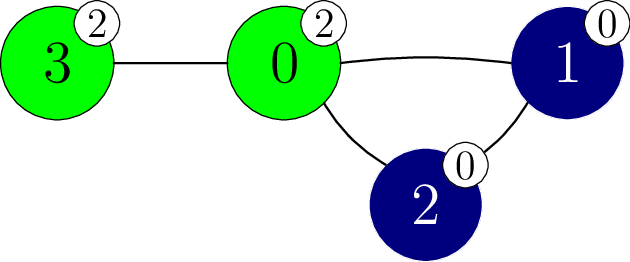

# Adivinanza de la Esfinge

La Gran Esfinge te tiene una adivinanza. 
Se te da un grafo de $N$ vértices.
Los vértices están numerados de  $0$ a $N - 1$.
Hay $M$ aristas en el grafo, numeradas de $0$ a $M-1$.
Cada arista conecta un par de vértices distintos y es bidireccional.
Específicamente, para cada $j$ de $0$ a $M - 1$, inclusive, la arista $j$ conecta los vértices $X[j]$ y $Y[j]$.
Hay a lo más una arista conectando cualquier par de vértices.
Se dice que dos vértices son **adyacentes**
 si están conectados por una arista.

Una secuencia de vértices  $v_0, v_1, \ldots, v_k$ (para  $k \ge 0$)
se llama un  **camino**
 si cada dos vértices consecutivos  $v_l$ y $v_{l+1}$
 (para cada $l$ tal que $0 \le l \lt k$)
 son adyacentes.
Decimos que un camino  $v_0, v_1, \ldots, v_k$ **conecta** a los vértices  $v_0$ y $v_k$.
En el grafo que se te da, cada par de vértices están conectados por algún camino.

Hay  $N + 1$ colores, numerados de $0$ a $N$.
El color $N$ es especial y es llamado el **color de la Esfinge**.
A cada vértice se le asigna un color.
Específicamente, el vértice $i$ ($0 \le i \lt N$) tiene color $C[i]$.
Varios vértices pueden tener el mismo color, 
 y pueden haber colores no asignados a ningún vértice. 
Ningún vértice tiene el color de la Esfinge, es decir que, $0 \le C[i] \lt N$ (para todo $i$ tal que $0 \le i \lt N$).

Un camino $v_0, v_1, \ldots, v_k$ (for $k \ge 0$)
 se llama  **monocromático** si todos sus vértices tienen el mismo color. es decir, $C[v_l] = C[v_{l+1}]$ (para cada  $l$ tal que $0 \le l \lt k$).
Adicionalmente, decimos que los vértices $p$ y $q$ ($0 \le p \lt N$, $0 \le q \lt N$)
 están en la misma **componente monocromática**
 si y solamente si están conectados por un camino monocromático.


Conoces los vértices y las aristas del grafo, pero no sabes que color tiene 
 cada vértice. Quieres encontrar los colores de los vértices, para lo cual puedes realizar **experimentos recoloreadores**.

En un experimento recoloreador, puedes recolorear un número arbitrario de vértices. 
Específicamente, para realizar un experimento recoloreador 
 primero eliges un arreglo
  $E$ de tamaño $N$,
 donde para cada $i$ ($0 \le i \lt N$),
 $E[i]$ está entre $-1$ y $N$ **inclusive**.
Entonces, el color de cada vértice  $i$ se vuelve $S[i]$, donde el valor de  $S[i]$ es:
* $C[i]$, esto es, el color original de  $i$, si $E[i] = -1$, o
* $E[i]$, en otro caso.

Nota que esto implica que puedes usar el color de la Esfinge en tu recoloración.

Finalmente, la Gran Esfinge anuncia el número de componentes monocromáticas en el grafo,
 después de poner el color de cada vértice $i$ a $S[i]$ ($0 \le i \lt N$).
La nueva coloración se aplica solamente para este experimento de recoloración, de modo que 
 **los colores de todos los vértices vuelven a ser los originales después que el experimento termina**.

Tu tarea es identificar los colores de los vértices en el grafo ejecutando a lo más 
  $2\,750$ experimentos de recoloración. 
Puedes recibir un puntaje parcial si determinas
 correctamente si cada par de vértices adyacentes tiene el mismo color o no. 

## Detalles de la Implementación,

Debes implementar la siguiente función.
```
std::vector&lt;int&gt; find_colours(int N,
    std::vector&lt;int&gt; X, std::vector&lt;int&gt; Y)
```

* $N$: el número de vértices en el grafo.
* $X$, $Y$: arreglos de longitud $M$ describiendo las aristas.
* Esta función debe retornar un arreglo $G$ de longitud $N$, que representa los colores de los vértices del grafo.
* Esta función es llamada exactamente una vez por cada caso de prueba.

La función de arriba puede hacer llamadas a la siguiente función para realizar experimentos de recoloración.
```
int perform_experiment(std::vector&lt;int&gt; E)
```

* $E$: un arreglo de longitud $N$ especificando como deben ser recoloreados los vértices.
* Esta función retorna el número de componentes monocromáticas del grafo después de recolorear los vértices de acuerdo al arreglo $E$.
* Esta función puede ser llamada a lo más $2\,750$ veces.

El calificador no es adaptativo, esto significa que, los colores de los vértices están fijos antes de que la llamada a  `find_colours` sea realizada.

## Restricciones

* $2 \le N \le 250$
* $N - 1 \le M \le \frac{N \cdot (N - 1)}{2}$
* $0 \le X[j] \lt Y[j] \lt N$ para cada $j$ tal que $0 \le j \lt M$.
* $X[j] \neq X[k]$ o $Y[j] \neq Y[k]$
   para cada $j$ y $k$ tal que $0 \le j \lt k \lt M$.
* Cada par de vértices están conectados por algún camino.
* $0 \le C[i] \lt N$ para cada $i$ tal que $0 \le i \lt N$.

## Subtareas

| Subtarea | Puntaje  | Restricciones adicionales |
| :-----: | :----: | ---------------------- |
| 1       | $3$    | $N = 2$
| 2       | $7$    | $N \le 50$
| 3       | $33$   | El grafo es un camino: $M = N - 1$ y los vértices $j$ y $j+1$ son adyacentes ($0 \leq j < M$).
| 4       | $21$   | El grafo es completo: $M = \frac{N \cdot (N - 1)}{2}$ y cualquier par de vértices son adyacentes.
| 5       | $36$   | Sin restricciones adicionales.

En cada subtarea, puedes obtener un puntaje parcial si tu programa determina correctamente para cualquier par de 
vértices adyacentes si estos tienen el mismo color o no.


Más precisamente, obtienes el puntaje completo de una subtarea si en todos sus casos de prueba el arreglo $G$ retornado
 por `find_colours` es exactamente igual al arreglo $C$ (es decir, $G[i] = C[i]$ para todo $i$ tal que $0 \le i \lt N$).
De lo contrario, obtendrás $50\%$ del puntaje para una subtarea si las siguientes condiciones se cumplen en todos sus casos de prueba:
* $0 \le G[i] \lt N$
   para cada $i$ tal que $0 \le i \lt N$;
* Para cada $j$ tal que $0 \le j \lt M$:
  * $G[X[j]] = G[Y[j]]$ si y solo si $C[X[j]] = C[Y[j]]$.

## Ejemplo

Considera la siguiente llamada.
```
find_colours(4, [0, 1, 0, 0], [1, 2, 2, 3])
```
Para este ejemplo, suponga que los colores (ocultos) de los vértices están dados por 
 $C = [2, 0, 0, 0]$.
Este escenario es descrito en la siguiente figura.
Los colores están representados por números en etiquetas blancas añadidas a cada vértice.


La función podría llamar a  `perform_experiment` como sigue.

```
perform_experiment([-1, -1, -1, -1])
```

En este llamado, ningún vértice es recoloreado, así que todos los vértices mantienen sus colores originales.

Considere el vértice $1$ y el vértice $2$.
Ambos tienen color $0$ y el camino $1,2$ es un camino monocromático.
Como resultado, los vértices $1$ y $2$ están en la misma componente monocromática.

Considere el vértice $1$ y el vértice $3$, a pesar de que ambos tienen color $0$, están en diferentes componentes
monocromáticas ya que no hay un camino monocromático conectándolos.

En general, hay $3$ componentes monocromáticas, con vértices $\{0\}$, $\{1, 2\}$, y $\{3\}$.
Luego, esta llamada retorna $3$.

Ahora, la función podría llamar a `perform_experiment` como sigue.

```
perform_experiment([0, -1, -1, -1])
```

En esta llamada, solo el vértice $0$ es recoloreado al color $0$, lo que resulta en el coloreo mostrado en la siguiente imagen.


Esta llamada retorna $1$, ya que todos los vértices pertenecen a la misma componente monocromática.
Ahora podemos deducir que los vértices $1$, $2$, y $3$ tienen color $0$.

Luego, la función podría llamar `perform_experiment` como sigue.

```
perform_experiment([-1, -1, -1, 2])
```
En esta llamada, el vértice $3$ es recoloreado al color $2$ lo que resulta en el coloreo mostrado en la siguiente imagen.



Esta llamada retorna $2$, ya que hay $2$ componentes monocromáticas, con vértices $\{0, 3\}$ and $\{1, 2\}$ respectivamente.
Ahora podemos deducir que el vértice $0$ tiene color $2$.

La función `find_colours` retorna el arreglo $[2, 0, 0, 0]$.
Dado que $C = [2, 0, 0, 0]$, obtienes puntaje completo.

Nota que hay multiples arreglos para los cuales obtendrías $50\%$ del puntaje, por ejemplo $[1, 2, 2, 2]$ o $[1, 2, 2, 3]$.

## Evaluador de ejemplo

Formato de entrada:

```
N  M
C[0]  C[1] ... C[N-1]
X[0]  Y[0]
X[1]  Y[1]
...
X[M-1]  Y[M-1]
```

Formato de salida

```
L  Q
G[0]  G[1] ... G[L-1]
```
Aquí, $L$ es la longitud del arreglo $G$ retornado por `find_colours`,
 Y $Q$ es el número de llamados a la función `perform_experiment`.