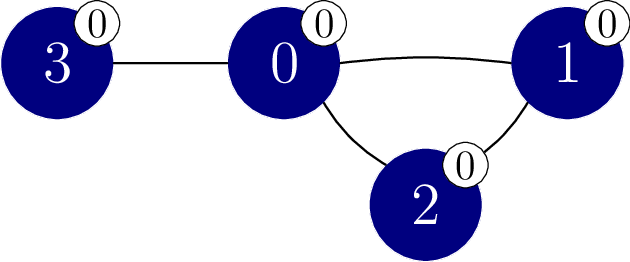

# Šalakina zagonetka

Profesor Šalaka vam daje zagonetku.
Zadan vam je graf sa $N$ čvorova.
Čvorovi su numerisani od $0$ do $N-1$.
Postoji $M$ ivica u grafu, numerisanih od $0$ do $M-1$.
Svaka ivica je dvosmjerna i povezuje par različitih čvorova.
Specifično, za svako $j$ od $0$ do $M - 1$, uključujući oba,
 ivica $j$ povezuje čvorove $X[j]$ i $Y[j]$.
Postoji najviše jedna ivica koja povezuje bilo koji par čvorova.
Za dva čvora kažemo da su **susjedni** ako su povezani ivicom.

Niz čvorova $v_0, v_1, \ldots, v_k$ (za $k \ge 0$)
 zovemo **put**
 ako su svaka dva čvora $v_l$ i $v_{l+1}$
 (za svako $l$ takvo da $0 \le l \lt k$)
 susjedni.
Kažemo da put $v_0, v_1, \ldots, v_k$ **povezuje** čvorove $v_0$ i $v_k$.
U zadanom grafu svaki par čvorova je povezan nekim putem.

Postoji $N+1$ boja, numerisane od $0$ do $N$.
Boja $N$ je specijalna (komplementarna šućmurastoj) i zovemo je **Šalakina boja**.
Svakom čvoru je dodjeljena boja.
Specifično, čvor $i$ ($0 \le i \lt N$) ima boju $C[i]$.
Više čvorova može imati istu boju i može postojati boja koja nije dodjeljena nijednom čvoru.
Nijedan čvor nema Šalakinu boju, odnosno, $0 \le C[i] \lt N$ ($0 \le i \lt N$).

Za put $v_0, v_1, \ldots, v_k$ (za $k \ge 0$)
 kažemo da je **jednobojan**
 ako svi njegovi čvorovi imaju istu boju,
 tj. $C[v_l] = C[v_{l+1}]$ (za svaki $l$ takav da $0 \le l \lt k$).
Također, kažemo da su čvorovi $p$ i $q$ ($0 \le p \lt N$, $0 \le q \lt N$)
 u istoj **jednobojnoj komponenti** ako i samo ako (akko) su povezani jednobojnim putem.

Poznati su vam čvorovi i ivice, ali ne i boje svakog čvora.
Želite saznati boje čvorova uz pomoć **eksperimenata farbanja**.

U eksperimentu farbanja možete promijeniti boje proizvoljnog broja čvorova.
Specifično, za eksperiment farbanja prvo birate niz $E$ veličine $N$,
 gdje za svaki $i$ ($0 \le i \lt N$),
 $E[i]$ je između $-1$ i $N$ **uključujući oba**.
Dalje, boja svakog čvora $i$ postoje $S[i]$, gdje je vrijednost $S[i]$ jednaka:
* $C[i]$, dakle početnoj boji čvora $i$, ako $E[i] = -1$, ili
* $E[i]$, inače.

Ovo znači da možete koristiti Šalakinu boju sa farbanje.

Konačno, profesor Šalaka vam govori broj jednobojnih komponenti u grafu nakon postavljanja boje svakog čvora $i$ na $S[i]$ ($0 \le i \lt N$).
Farbanje je primjenjeno samo na ovaj jedan eksperiment farbanja, dakle **boje svih čvorova se vrate na početne vrijednosti nakon što eksperiment završi**.

Vaš zadatak je odrediti boje čvorova u grafu tako što obavite najviše $2\,750$ eksperimenata farbanja.
Dobit ćete parcijalne bodove ako za svaki par susjednih čvorova da li imaju istu boju.

## Detalji implementacije

Poterbno je da implementirate sljedeću proceduru:

```
std::vector&lt;int&gt; find_colours(int N,
    std::vector&lt;int&gt; X, std::vector&lt;int&gt; Y)
```

* $N$: broj čvorova u grafu.
* $X$, $Y$: nizovi dužine $M$ koji opsuju ivice grafa.
* Ova procedura treba vratiti niz $G$ dužine $N$,
   koji predstavlja boje ivica u grafu.
* Ova procedura će biti pozvana tačno jednom na svakom testnom primjeru.

Procedura iznad može praviti pozive sljedećoj proceduri da pravi eksperimente farbanja:
```
int perform_experiment(std::vector&lt;int&gt; E)
```

* $E$: niz dužine $N$ koji specificira kako treba promijeniti boje čvorova.
* Ova procedura vraća broj jednobojnih komponenti nakon farbanja u skladu sa $E$.
* Ovu proceduru možete pozvati najviše $2\,750$ puta.

Grader **nije adaptivan**, odnosno, boje čvorova su određene prije poziva proceure `find_colours`.

## Ograničenja

* $2 \le N \le 250$
* $N - 1 \le M \le \frac{N \cdot (N - 1)}{2}$
* $0 \le X[j] \lt Y[j] \lt N$ za svako $j$ takvo da $0 \le j \lt M$.
* $X[j] \neq X[k]$ ili $Y[j] \neq Y[k]$
   za svako $j$ i $k$ takvo da $0 \le j \lt k \lt M$.
* Svaki par čvorova je povezan nekim putem.
* $0 \le C[i] \lt N$ za svaki $i$ takav da $0 \le i \lt N$.

## Podzadaci

| Podzadatak | Bodovi  | Dodatna ograničenja |
| :-----: | :----: | ---------------------- |
| 1       | $3$    | $N = 2$
| 2       | $7$    | $N \le 50$
| 3       | $33$   | Graf je put: $M = N - 1$ i čvorovi $j$ i $j+1$ su susjedni ($0 \leq j < M$).
| 4       | $21$   | Graf je kompletan: $M = \frac{N \cdot (N - 1)}{2}$ i svaka dva čvora su susjedna.
| 5       | $36$   | Bez dodatnih ograničenja.

U svakom podzadatku možete dobiti parcijalne bodove
 ako vaš program za svaki par susjednih čvorova ispravno odredi da li su iste boje.

Preciznije, dobit ćete sve bodove za podzadatak ako je u svim testnim primjerima tog podzadataka niz $G$ koji vrati `find_colours` taćno isti kao niz $C$
 (tj. $G[i] = C[i]$
 za sve $i$ takve da $0 \le i \lt N$).
Inače,
 dobijate $50\%$ bodova za podzadatak ako vrijede sljedeći uslovi za sve testne primjere:
* $0 \le G[i] \lt N$
   za svako $i$ takvo da $0 \le i \lt N$;
* Za svako $j$ takvo da $0 \le j \lt M$:
  * $G[X[j]] = G[Y[j]]$ ako i samo ako (akko) $C[X[j]] = C[Y[j]]$.

## Primjer

Razmotrimo sljedeći poziv:

```
find_colours(4, [0, 1, 0, 0], [1, 2, 2, 3])
```

U ovom primjeru pretpostavimo da su (skrivene) boje čvorova $C = [2, 0, 0, 0]$.
Ovaj slučaj je prikazan na slici ispod.
Boje su, dodatno, predstavljene brojevima u bijelim kružićima uz svaki čvor.


Procedura može pozvati `perform_experiment` na sljedeći način:

```
perform_experiment([-1, -1, -1, -1])
```

U ovom pozivu nijedom čvoru nije promjenjena boja.

Razmotrimo čvorove $1$ i $2$.
Oba imaju boju $0$ i put $1, 2$ je jednobojan put.
Zbog ovoga čvorovi $1$ i $2$ su u istoj jednobojnoj komponenti.

Razmotrimo čvorove $1$ i $3$.
Iako oba imaju boju $0$ oni su u različitim jednobojnim komponentama pošto ne postoji jednobojan put koji ih povezuje.

Sveukupno postoje $3$ jednobojne komponente, sa čvorovima $\{0\}$, $\{1, 2\}$, i $\{3\}$.
Dakle, ovaj poziv vraća $3$.

Sada procedura može pozvati`perform_experiment` na sljedeći način:

```
perform_experiment([0, -1, -1, -1])
```

U ovom pozivu samo je čvoru $0$ promjenjena boja u boju 0 $0$,
 što vodi do situacije prikazane na slici ispod.



Ovaj poziv vraća $1$, pošto svi čvorovi pripadaju istoj jednobojnoj komponenti.
Možemo sada zaključiti da čvorovi $1$, $2$ i $3$ imaju boju $0$.

Procedura može nakon toga pozvati `perform_experiment` na sljedeći način:

```
perform_experiment([-1, -1, -1, 2])
```

U ovom pozivu čvoru $3$ je promjenjena boja na boju $2$,
 što vodi do situacije prikazane na sljedećoj slici:


Ovaj poziv vraća $2$, pošto postoje $2$ jednobojne komponente,
 sa čvorovima $\{0, 3\}$ i $\{1, 2\}$. 
Možemo zaključiti da čvor $0$ ima boju $2$.

Procedura `find_colours` vraća niz $[2, 0, 0, 0]$.
Pošto $C = [2, 0, 0, 0]$, puni bodovi su dodjeljeni.

Napominjemo da postoji više povratnih vrijednosti za koje bi se dodijelilo $50\%$ bodova, na primjer $[1, 2, 2, 2]$ ili $[1, 2, 2, 3]$.

## Sample Grader

Format ulaza:

```
N  M
C[0]  C[1] ... C[N-1]
X[0]  Y[0]
X[1]  Y[1]
...
X[M-1]  Y[M-1]
```

Format izlaza:

```
L  Q
G[0]  G[1] ... G[L-1]
```

Ovdje, $L$ je dužina niza $G$ koju vrati `find_colours`,
 i $Q$ je broj poziva procedure `perform_experiment`.
