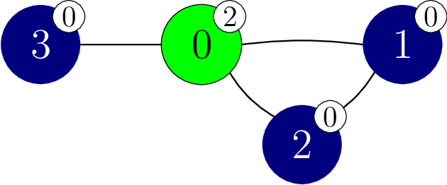

# Enigma da Esfinge

A Grande Esfinge tem um enigma para você. 
Você recebe um grafo com $N$ vértices.
Os vértices são numerados de $0$ a $N - 1$.
Há $M$ arestas no grafo, numeradas de $0$ a $M-1$.
Cada aresta conecta um par de vértices distintos e é bidirecional.
Especificamente, para cada $j$ de $0$ a $M - 1$ (inclusive)
 a aresta $j$ conecta os vértices $X[j]$ e $Y[j]$.
Há no máximo uma aresta conectando qualquer par de vértices.
Dois vértices são chamados de **adjacentes**
 se estiverem conectados por uma aresta.

Uma sequência de vértices $v_0, v_1, \ldots, v_k$ (para $k \ge 0$)
 é chamada de **caminho**
 se cada dois vértices consecutivos $v_l$ e $v_{l+1}$
 (para cada $l$ tal que $0 \le l \lt k$)
 são adjacentes.
Dizemos que um caminho $v_0, v_1, \ldots, v_k$ **conecta** os vértices $v_0$ e $v_k$.
No grafo fornecido a você, cada par de vértices está conectado por algum caminho.

Existem $N + 1$ cores, numeradas de $0$ a $N$.
A cor $N$ é especial e é chamada de **cor da Esfinge**.
Cada vértice recebe uma cor.
Especificamente, o vértice $i$ ($0 \le i \lt N$) tem cor $C[i]$.
Vários vértices podem ter a mesma cor, 
e pode haver cores não atribuídas a nenhum vértice.
Nenhum vértice tem a cor da Esfinge,
 isto é, $0 \le C[i] \lt N$ ($0 \le i \lt N$).

Um caminho $v_0, v_1, \ldots, v_k$ (para $k \ge 0$)
 é chamado de **monocromático**
 se
 todos os seus vértices têm a mesma cor,
 ou seja, $C[v_l] = C[v_{l+1}]$ (para cada $l$ tal que $0 \le l \lt k$).
Além disso, dizemos que os vértices $p$ e $q$ ($0 \le p \lt N$, $0 \le q \lt N$)
 estão na mesma **componente monocromática**
 se e somente se eles estiverem conectados por um caminho monocromático.

Você conhece os vértices e arestas,
 mas você não sabe qual cor cada vértice tem.
Você quer descobrir as cores dos vértices,
 realizando **experimentos de recoloração**.

Em um experimento de recoloração,
 você pode recolorir arbitrariamente muitos vértices.
Especificamente, para realizar um experimento de recoloração
 você primeiro escolhe um vetor $E$ de tamanho $N$,
 onde para cada $i$ ($0 \le i \lt N$),
 $E[i]$ está entre $-1$ e $N$ **inclusive**.
Então, a cor de cada vértice $i$ se torna $S[i]$, onde o valor de $S[i]$ é:
* $C[i]$, ou seja, a cor original de $i$ , se $E[i] = -1$ , ou
* $E[i]$, caso contrário.

Observe que isso significa que você pode usar a cor da Esfinge na sua recoloração.

Finalmente, a Grande Esfinge anuncia
 o número de componentes monocromáticas no grafo,
 depois de definir a cor de cada vértice $i$ para $S[i]$ ($0 \le i \lt N$).
A nova coloração é aplicada apenas para este experimento de recoloração específico,
 então **as cores de todos os vértices retornam às originais após o término do experimento**.

Sua tarefa é identificar as cores dos vértices no grafo
 realizando no máximo $2\,750$ experimentos de recoloração. 
Você também pode receber uma pontuação parcial
 se você determinar corretamente para cada par de vértices adjacentes,
 se eles têm a mesma cor.

## Detalhes de implementação

Você deve implementar o seguinte procedimento.

```
std::vector&lt;int&gt; find_colours(int N,
 std::vector&lt;int&gt; X, std::vector&lt;int&gt; Y)
```

* $N$: o número de vértices no grafo.
* $X$, $Y$: vetores de tamanho $M$ descrevendo as arestas.
* Este procedimento deve retornar um vetor $G$ de tamanho $N$, representando as cores dos vértices no grafo.
* Este procedimento é chamado exatamente uma vez para cada caso de teste.

O procedimento acima pode fazer chamadas para o seguinte procedimento
 para realizar experimentos de recoloração:

```
int perform_experiment(std::vector&lt;int&gt; E)
```

* $E$: um vetor de tamanho $N$ especificando como os vértices devem ser recoloridos.
* Este procedimento retorna o número de componentes monocromáticas
   depois de recolorir os vértices de acordo com $E$.
* Este procedimento pode ser chamado no máximo $2\,750$ vezes.

O corretor **não é adaptativo**, ou seja,
 as cores dos vértices são fixadas antes que uma chamada para `find_colours` seja feita.

## Restrições

* $2 \le N \le 250$
* $N - 1 \le M \le \frac{N \cdot (N - 1)}{2}$
* $0 \le X[j] \lt Y[j] \lt N$ para cada $j$ tal que $0 \le j \lt M$.
* $X[j] \neq X[k]$ ou $Y[j] \neq Y[k]$
   para cada $j$ e $k$ tais que $0 \le j \lt k \lt M$.
* Cada par de vértices é conectado por algum caminho.
* $0 \le C[i] \lt N$ para cada $i$ tal que $0 \le i \lt N$.

## Subtarefas

| Subtarefa | Pontuação | Restrições adicionais |
| :-----: | :----: | ---------------------- |
| 1 | $3$ | $N = 2$
| 2 | $7$ | $N \le 50$
| 3 | $33$ | O grafo é um caminho: $M = N - 1$ e os vértices $j$ e $j+1$ são adjacentes ($0 \leq j < M$).
| 4 | $21$ | O grafo é completo: $M = \frac{N \cdot (N - 1)}{2}$ e quaisquer dois vértices são adjacentes.
| 5 | $36$ | Sem restrições adicionais.

Em cada subtarefa, você pode obter uma pontuação parcial
 se o seu programa determinar corretamente
 para cada par de vértices adjacentes
 se eles têm a mesma cor.

Mais precisamente,
 você obtém a pontuação total de uma subtarefa
 se, em todos os seus casos de teste,
 o vetor $G$ retornado por `find_colours`
 é exatamente o mesmo que o vetor $C$
 (ou seja $G[i] = C[i]$
 para todo $i$ tal que $0 \le i \lt N$).
Alternativamente,
 você ganha $50\%$ da pontuação para uma subtarefa
 se as seguintes condições forem atendidas
 em todos os seus casos de teste:
* $0 \le G[i] \lt N$
   para cada $i$ tal que $0 \le i \lt N$ ;
* Para cada $j$ tal que $0 \le j \lt M$:
  * $G[X[j]] = G[Y[j]]$ se e somente se $C[X[j]] = C[Y[j]]$.

## Exemplo

Considere a seguinte chamada.

```
find_colours(4, [0, 1, 0, 0], [1, 2, 2, 3])
```

Para este exemplo, suponha que
 as cores (ocultas) dos vértices são dadas por
 $C = [2, 0, 0, 0]$.
Este cenário é mostrado na figura a seguir.
As cores também são representadas por números em etiquetas brancas fixadas em cada vértice.



O procedimento pode chamar `perform_experiment` da seguinte maneira.

```
perform_experiment([-1, -1, -1, -1])
```

Nesta chamada, nenhum vértice é recolorido, pois todos os vértices mantêm suas cores originais.

Considere o vértice $1$ e o vértice $2$.
Ambos têm a cor $0$ e o caminho $1, 2$ é um caminho monocromático.
Como resultado, os vértices $1$ e $2$ estão na mesma componente monocromática.

Considere o vértice $1$ e o vértice $3$.
Embora ambos tenham a cor $0$,
 eles estão em diferentes componentes monocromáticas
 pois não há um caminho monocromático conectando-os.

No total, existem $3$ componentes monocromáticas,
 com vértices $\{0\}$, $\{1, 2\}$ e $\{3\}$.
Portanto, esta chamada retorna $3$.

Agora o procedimento pode chamar `perform_experiment` da seguinte maneira.

```
perform_experiment([0, -1, -1, -1])
```

Nesta chamada, apenas o vértice $0$ é recolorido para a cor $0$,
 o que resulta na coloração mostrada na figura a seguir.


Esta chamada retorna $1$, pois todos os vértices pertencem à mesma componente monocromática.
Agora podemos deduzir que os vértices $1$, $2$ e $3$ têm cor $0$.

O procedimento pode então chamar `perform_experiment` da seguinte maneira.

```
perform_experiment([-1, -1, -1, 2])
```

Nesta chamada, o vértice $3$ é recolorido para a cor $2$,
 o que resulta na coloração mostrada na figura a seguir.


Esta chamada retorna $2$, pois há $2$ componentes monocromáticas,
 com vértices $\{0, 3\}$ e $\{1, 2\}$ respectivamente. 
Podemos deduzir que o vértice $0$ tem cor $2$.

O procedimento `find_colours` então retorna o vetor $[2, 0, 0, 0]$.
Como $C = [2, 0, 0, 0]$, a pontuação total é fornecida.

Observe que também há vários valores de retorno para os quais $50\%$ da pontuação seria fornecida, por exemplo $[1, 2, 2, 2]$ ou $[1, 2, 2, 3]$.

## Corretor Exemplo

Formato de entrada:

```
NM
C[0] C[1] ... C[N-1]
X[0] Y[0]
X[1] Y[1]
...
X[M-1] Y[M-1]
```

Formato de saída:

```
LQ
G[0] G[1] ... G[L-1]
```

Aqui, $L$ é o tamanho do vetor $G$ retornado por `find_colours`,
 e $Q$ é o número de chamadas para `perform_experiment` .